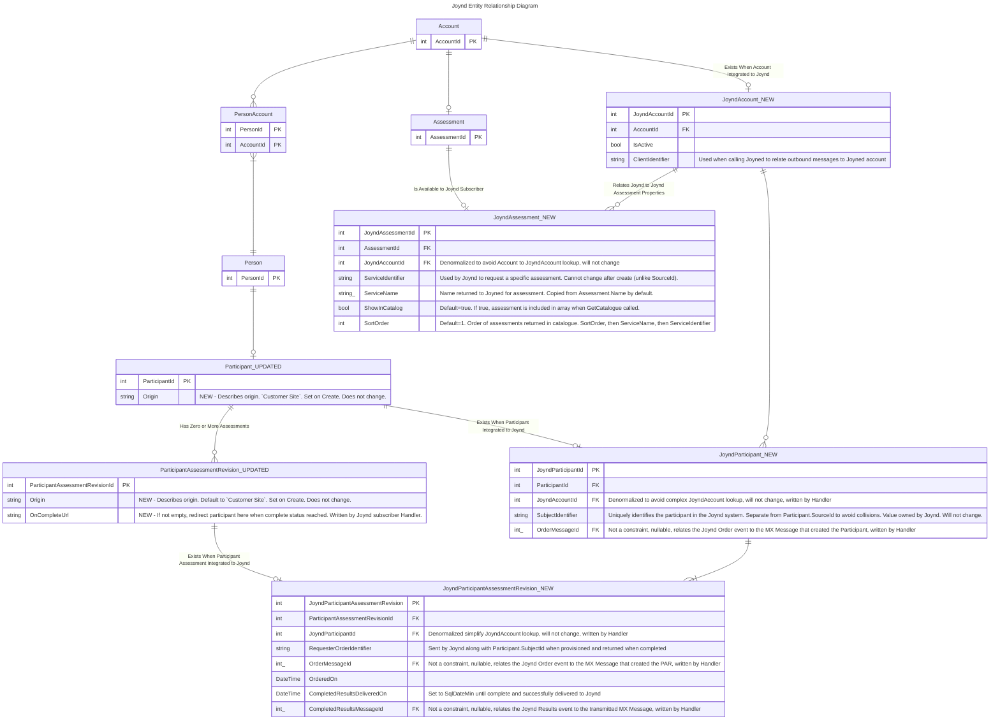

# Unity API Questions

1.  Blah
2.  Blah 2

```mermaid
---
title: Joynd Entity Relationship Diagram
---

erDiagram 
    Account {
      int AccountId PK ""
    }
    ParticipantAssessmentRevision_UPDATED {
    	int ParticipantAssessmentRevisionId PK ""
    	string Origin "NEW - Describes origin. Default to `Customer Site`. Set on Create. Does not change."
      string OnCompleteUrl "NEW - If not empty, redirect participant here when complete status reached. Written by Joynd subscriber Handler."      
    }
    Participant_UPDATED {
      int ParticipantId PK ""
      string Origin "NEW - Describes origin. `Customer Site`. Set on Create. Does not change."
    }
    JoyndAccount_NEW {
      int JoyndAccountId PK
    	int AccountId FK ""
    	bool IsActive
    	string ClientIdentifier "Used when calling Joyned to relate outbound messages to Joyned account"
    }
    JoyndParticipantAssessmentRevision_NEW {
      int JoyndParticipantAssessmentRevision PK
	    int ParticipantAssessmentRevisionId FK
	    int JoyndParticipantId FK "Denormalized simplify JoyndAccount lookup, will not change, written by Handler"
	    string RequesterOrderIdentifier "Sent by Joynd along with Participant.SubjectId when provisioned and returned when completed"
      int_ OrderMessageId FK "Not a constraint, nullable, relates the Joynd Order event to the MX Message that created the PAR, written by Handler"
      DateTime OrderedOn
      DateTime CompletedResultsDeliveredOn "Set to SqlDateMin until complete and successfully delivered to Joynd"
    	int_ CompletedResultsMessageId FK "Not a constraint, nullable, relates the Joynd Results event to the transmitted MX Message, written by Handler"
    }
    JoyndAssessment_NEW {
       int JoyndAssessmentId PK
       int AssessmentId FK
       int JoyndAccountId FK "Denormalized to avoid Account to JoyndAccount lookup, will not change"
       string ServiceIdentifier "Used by Joynd to request a specific assessment. Cannot change after create (unlike SourceId)."
       string_ ServiceName "Name returned to Joyned for assessment. Copied from Assessment.Name by default."
       bool ShowInCatalog "Default=true. If true, assessment is included in array when GetCatalogue called."
       int SortOrder "Default=1. Order of assessments returned in catalogue. SortOrder, then ServiceName, then ServiceIdentifier"
    }
    JoyndParticipant_NEW {
      int JoyndParticipantId PK
    	int ParticipantId FK
      int JoyndAccountId FK "Denormalized to avoid complex JoyndAccount lookup, will not change, written by Handler"
    	string SubjectIdentifier "Uniquely identifies the participant in the Joynd system. Separate from Participant.SourceId to avoid collisions. Value owned by Joynd. Will not change."
      int_ OrderMessageId FK "Not a constraint, nullable, relates the Joynd Order event to the MX Message that created the Participant, written by Handler"
    }
    PersonAccount {
    	int PersonId PK
    	int AccountId PK
    }
    Person {
    	int PersonId PK
    }
    Assessment {
    	int AssessmentId PK
    }
    
    Account ||--o{ PersonAccount : ""
    PersonAccount }|--|| Person : ""
    Person ||--o| Participant_UPDATED : ""
    Account ||--o| Assessment : ""
    Assessment ||--o| JoyndAssessment_NEW : "Is Available to Joynd Subscriber"
    Account ||--o| JoyndAccount_NEW : "Exists When Account Integrated to Joynd"
    JoyndAccount_NEW ||--o{ JoyndAssessment_NEW : "Relates Joynd to Joynd Assessment Properties"
    Participant_UPDATED ||--o{ ParticipantAssessmentRevision_UPDATED : "Has Zero or More Assessments"
    ParticipantAssessmentRevision_UPDATED ||--o| JoyndParticipantAssessmentRevision_NEW : "Exists When Participant Assessment Integrated to Joynd"
    Participant_UPDATED ||--o| JoyndParticipant_NEW : "Exists When Participant Integrated to Joynd"
    JoyndParticipant_NEW ||--|{ JoyndParticipantAssessmentRevision_NEW : ""
    JoyndAccount_NEW ||--o{ JoyndParticipant_NEW : ""
    
```

